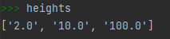
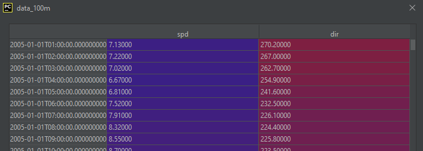

# WP-Meteo

## What is it?
Meteo is a Python package to easily load exported WindPRO meteo files into a pandas DataFrame.

## Install
The latest release is available as a package from PyPi and can be installed as such:
```shell
$ pip install wp-meteo
```
The latest development release can be installed as such:
```shell
$ pip install git+https://github.com/gpauvert/wp-meteo
```

### Requirements
- Pandas http://pandas.pydata.org/

## Example
Let's start by using the provided meteo file [here](files/)

Firstly, find the meteo file

```python
from pathlib import Path
from wp_meteo.loader import WindPRO

script_dir = Path(__file__).parent
relative_path = r"files/ERA5 (Gaussian Grid)_N56.065548_E009.12.txt"
src = (script_dir / relative_path).resolve()
```

Secondly, load the file into the WindPRO class and see the resulting available heights

```python
wind = WindPRO(src)
heights = wind.heights
```



The individual dataframes can then be accessed

```python
data_100m = wind.df["100.0"]
```


## Features

Only meteo files exported with **"fixed localization"** can be used.

Currently, the following information is read from the header:
- longitude
- latitude
- date time format
- decimal separator
- digit group separator
- displacement height
- utc offset

Currently, the following parameters are extracted from each height:
- spd: mean wind speed
- dir: direction
- temp: temperature
- turb: turbulence
- pressure: pressure
- rh: relative humidity

The status column of each parameter as well as the sample status are checked for each time step.
If a status value is not 0, as described in the header of the meteo file (see below),
then the time step for that parameter is disabled.


## Future

Potential options for development in the future are:
- expand the number of parameters that can be extracted